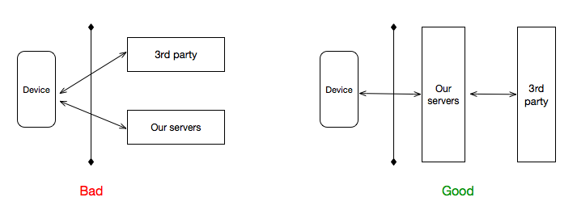

# Third Party

Third Party refers to pulling in content from 3rd party partners and trying to keep some sense of common branding and UX. For web sites, there are ways we can do this with some sense of security, like [OAuth](https://auth0.com/docs/design/browser-based-vs-native-experience-on-mobile). For Native apps, we should refrain with integration with 3rd party vendors. If we need to do this, then it's preferred that we levarge 3rd party partner APIs, consume data within our own server tier, then publish data to our native apps. With this approach, we have the following benefits: 

* **A better handle on security and session management:** no polling for session affinity, no need to reduce security. 
* **Consistent look and feel:** there has been little to no success with managing a consistent brand, look and feel, when we ask a 3rd party content provider to "_use our CSS and JavaScript, and be sure you know you are in a web view and hide your navigation controls..._". Not going to go well. 
* **Reduced risk with vendors changing services:** since we place a proxy service between our native apps and 3rd party APIs, we have an opportunity to swap 3rd party providers, place monitoring and alerts when their service(s) goes bad, etc. 

[Previous](05_healthcheck.md) | [Next](07_end.md)